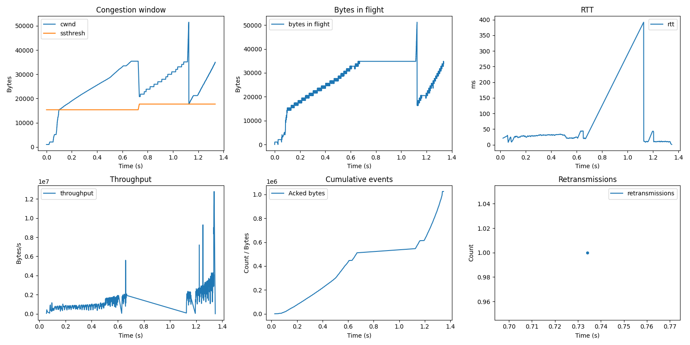

# Relatório

## Gráficos da execução do TCP.

## Cenário

A execução é sobre um envio de 1000 pacotes do cliente para o servidor, com uma simulação de 3 acks duplicados sobre o pacote 500.

### Comportamento observado

- CWND inicial é `MSS = 1024 bytes`, e `ssthresh = 15360`, o TCP inicia no Slow Start.
- Em Slow Start, a cada ACK recebido, a janela cresce em `MSS` bytes (de 0 até aproximadamente 0.1s no primeiro gráfico).
- Quando `cwnd >= ssthresh` (inicial de `15360 bytes`), o controle muda para Congestion Avoidance. É possível observar isso próximo de 0.1s no gráfico.
- Em Congestion Avoidance, o crescimento por ACK é aproximado por `(MSS^2) / cwnd`, ou seja, um aumento mais lento e linear no longo prazo (de aproximadamente 0.1s até aproximadamente 0.7s no primeiro gráfico). 
- Ao receber 3 ACKs duplicados do pacote perdido simulado, o pacote é retransmitido e o TCP entra em Fast Recovery. Nesse momento (em aproximadamente 0,7s no primeiro gráfico), é evidente que `ssthresh` vai para o valor que corresponde a metade do `cwnd`, e o `cwnd` tem uma queda. Também é visível a retransmissão no último gráfico.
- Neste estado (Fast Recovery), conforme ACKs duplicados adicionais vão chegando, a janela (`cwnd`) é inflada em `1 MSS`, até que o pacote não reconhecido seja reconhecido. Isso é observável no primeiro gráfico de aproximadamente 0.7s até aproximadamente 1.1s.
- Em aproximadamente 1.1s, o pacote não reconhecido é reconhecido, a janela é desinflada, isto é, `cwnd` vai para o valor correspondente a `ssthresh`. A partir disso (de aproximadamente 1.1s adiante), o protocolo segue em Congestion Avoidance.

Podemos perceber que os 3 ACKs duplicados funcionaram corretamente, e o cliente conseguiu entregar todos os pacotes esperados ao servidor, com todos os estados funcionando adequadamente.
