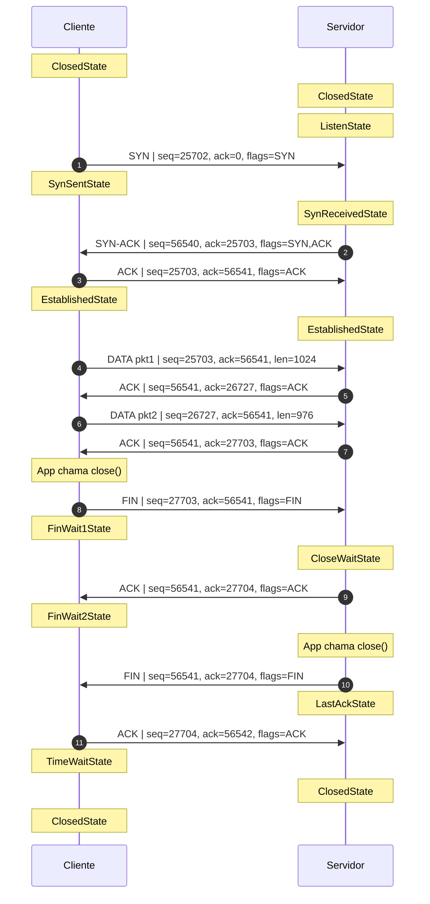

```mermaid
sequenceDiagram
    autonumber
    participant C as Cliente
    participant S as Servidor

    Note over C: ClosedState
    Note over S: ClosedState

    Note over S: ListenState
    C->>S: SYN | seq=25702, ack=0, flags=SYN
    Note over C: SynSentState
    Note over S: SynReceivedState

    S->>C: SYN-ACK | seq=56540, ack=25703, flags=SYN,ACK
    C->>S: ACK | seq=25703, ack=56541, flags=ACK
    Note over C: EstablishedState
    Note over S: EstablishedState

    C->>S: DATA pkt1 | seq=25703, ack=56541, len=1024
    S->>C: ACK | seq=56541, ack=26727, flags=ACK
    C->>S: DATA pkt2 | seq=26727, ack=56541, len=976
    S->>C: ACK | seq=56541, ack=27703, flags=ACK

    Note over C: App chama close()
    C->>S: FIN | seq=27703, ack=56541, flags=FIN
    Note over C: FinWait1State
    Note over S: CloseWaitState
    S->>C: ACK | seq=56541, ack=27704, flags=ACK
    Note over C: FinWait2State

    Note over S: App chama close()
    S->>C: FIN | seq=56541, ack=27704, flags=FIN
    Note over S: LastAckState
    C->>S: ACK | seq=27704, ack=56542, flags=ACK
    Note over C: TimeWaitState
    Note over S: ClosedState

    Note over C: ClosedState
```
