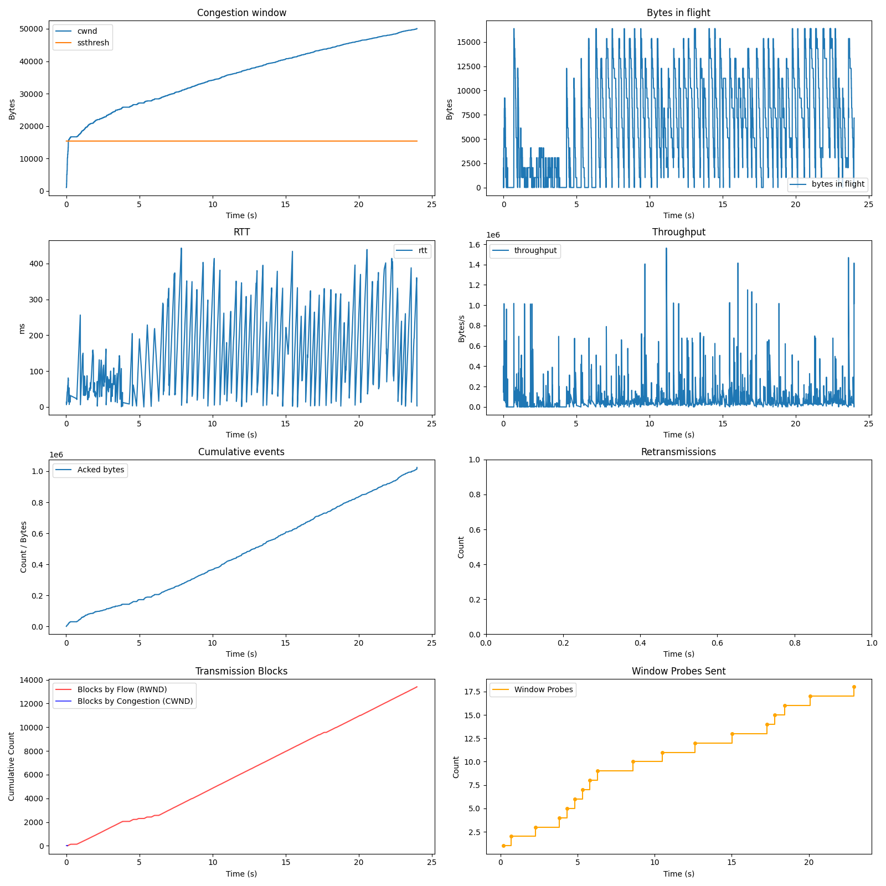
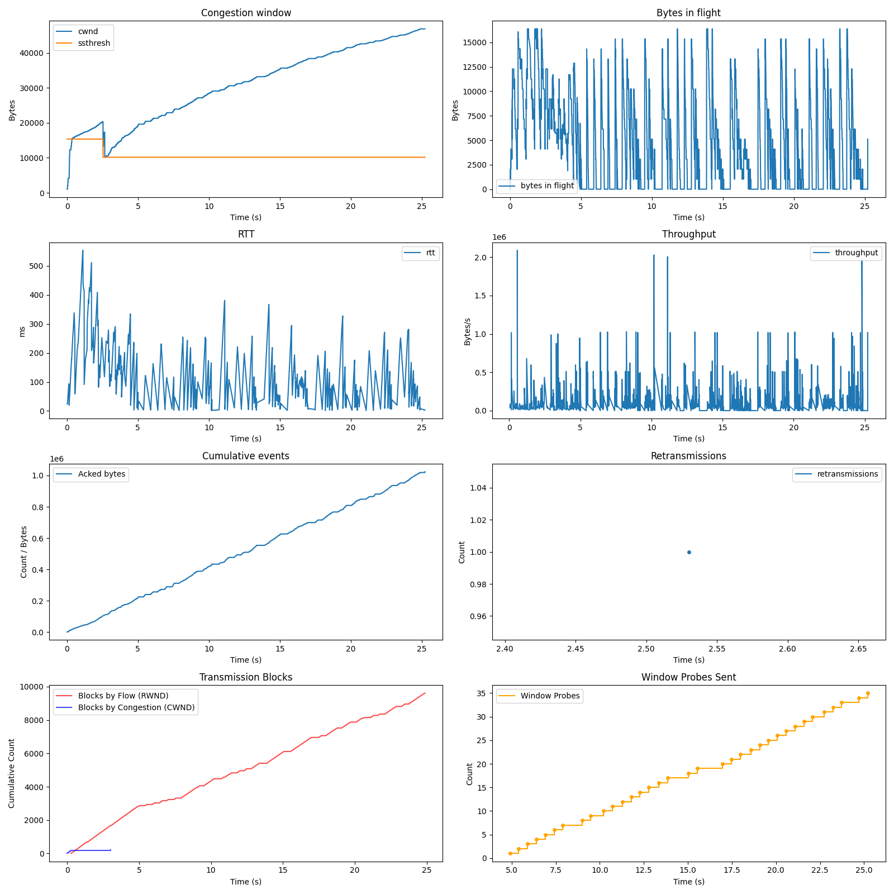

# Relatório

## Cenário

A execução é sobre o envio de 1024000 bytes do cliente para o servidor. A simulação aqui é com um buffer de recepção de tamanho de 16384 bytes, sem perda de pacotes.

### Gráfico

### Comportamento observado
- Considerando o gráfico `Congestion Window`, rapidamente `cwnd` ultrapassa o tamanho máximo do buffer do receptor. Isso significa, que bem no inicio da transmissão (quando `cwnd` < 16384), quem determina a janela de transmissão é o controle de congestionamento. A partir do momento em que `cwnd` > 16384, quem começa a controlar a janela de transmissão é o controle de fluxo, ja que o tamanho máximo do buffer é 16384, e o `cwnd` tem valor superior. Isso é oque demonstra o gráfico `Transmission Blocks`, onde bem no começo o controle de congestionamento é quem bloqueia a transmissão, e após `cwnd` > 16384, o controle de fluxo passa a bloquear.
- No gráfico `Window Probes Sent`, também podemos ver o envio de pacotes de sondagem ao servidor quando este indicava que seu buffer estava cheio, para que o cliente pudesse receber "novas informações" do estado do buffer do receptor.
- No gráfico `Bytes In Flight`, podemos ver que a quantidade de  bytes em voo respeitou o limite do buffer do receptor de 16384 bytes. Não houve extrapolação desse valor, mesmo em momentos que, o `cwnd` do controle de congestionamento (podendo ser visto no gráfico `Congestion Window`) tivesse um valor muito superior.

Podemos perceber assim que o Controle de Fluxo funcionou adequadamente, com o cliente conseguindo respeitar os limites do servidor, e entregando os pacotes esperados ao servidor.

## Cenário

A execução é sobre o envio de 1024000 bytes do cliente para o servidor. A simulação aqui é com um buffer de recepção de tamanho de 16384 bytes, com a perda de um pacote.

### Gráfico

### Comportamento observado
- Assim como no primeiro cenário, no gráfico `Congestion Window` podemos ver que, rapidamente `cwnd` ultrapassa o tamanho máximo do buffer do receptor. Então, nesse pequeno periodo, o controle de congestionamento é quem determina a janela de transmissão, e após isso, quem determina é o controle do fluxo. Oque muda neste caso, é que quando acontece a perda por 3 acks duplicados (em aproximadamente 2,5s), `cwnd` assume um valor próximo a 12500, ficando menor que o tamanho máximo do buffer do receptor (16384), e então, quem limita a transmissão é o controle de congestionamento. Porém, após `cwnd` voltar a ser maior que o tamanho maximo do buffer do receptor, o controle de fluxo assume como limitante novamente. No gráfico `Transmission Blocks`, podemos ver exatamente esse comportamento de bloqueio, sendo inicialmente pelo controle de congestionamento, após pelo controle de fluxo, em aproximadamente 2,5s quando `cwnd` < 16384 o controle de congestionamento assume novamente, e após `cwnd` > 16384 quem assume é o controle de fluxo novamente.
- O gráfico `Bytes In Flight` também reflete isso, sendo limitado inicialmente (bem no inicio) pelo controle de congestionamento, depois pelo controle de fluxo (nunca superando 16384), e em aproximadamente 2,5s, ele passa a ser limitado pelo controle de congestionamento novamente, que como havia dito, `cwnd` fica proximo de 12500, então a quantidade de bytes em voo se adequa a esse valor. Após o `cwnd` > 16384, o controle de fluxo passa a ser o limitante novamente, nunca extrapolando o valor de 16384.

Podemos perceber assim que o Controle de Fluxo funcionou adequadamente durante cenário de perda, com o cliente conseguindo respeitar os limites do servidor e do proprio controle de congestionamento, e entregando os pacotes esperados ao servidor.